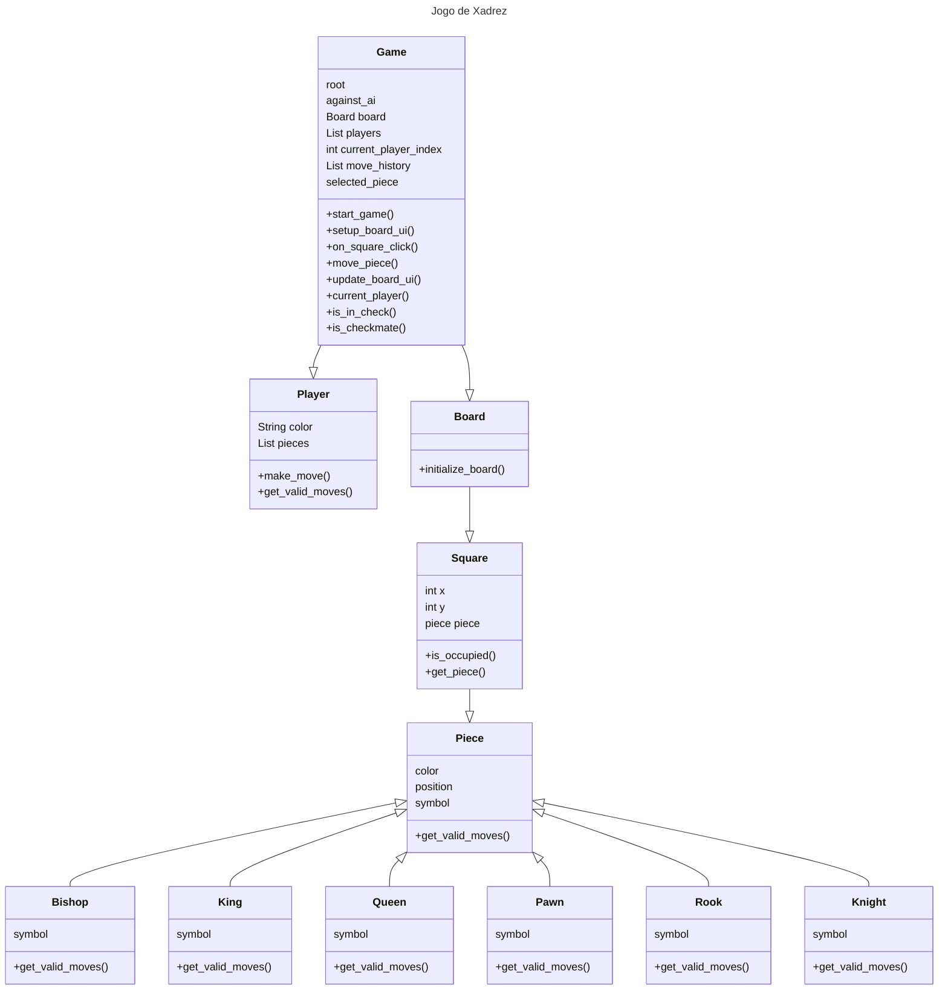

```mermaid
---
title: Jogo de Xadrez
---
classDiagram

class Player{
	String color
	List pieces
	+make_move()
	+get_valid_moves()
}

class Game{
	root
	against_ai
	Board board
	List players
	int current_player_index
	List move_history
	selected_piece

    +start_game()
    +setup_board_ui()
    +on_square_click()
    +move_piece()
    +update_board_ui()
    +current_player()
    +is_in_check()
    +is_checkmate()
}

class Board{
	+initialize_board()
}

class Square{
	int x
	int y
	piece piece
	+is_occupied()
	+get_piece()
}

class Piece{
	color
	position
	symbol
	+get_valid_moves()
}

class Bishop{
	symbol
	+get_valid_moves()
}

class King{
	symbol
	+get_valid_moves()
}

class Queen{
	symbol
	+get_valid_moves()
}

class Pawn{
	symbol
	+get_valid_moves()
}

class Rook{
	symbol
	+get_valid_moves()
}

class Knight{
	symbol
	+get_valid_moves()
}

Game --|> Board
Game --|> Player
Board --|> Square
Square --|> Piece

Piece <|-- Bishop
Piece <|-- King
Piece <|-- Queen
Piece <|-- Pawn
Piece <|-- Rook
Piece <|-- Knight
```
