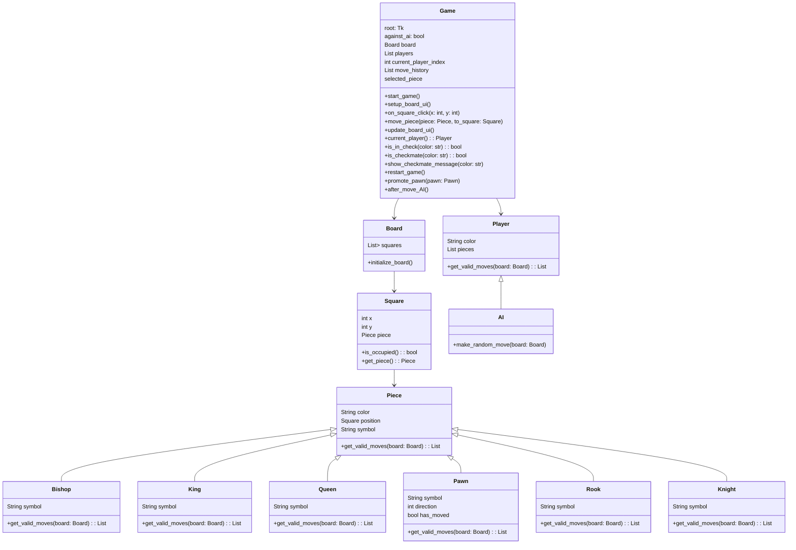
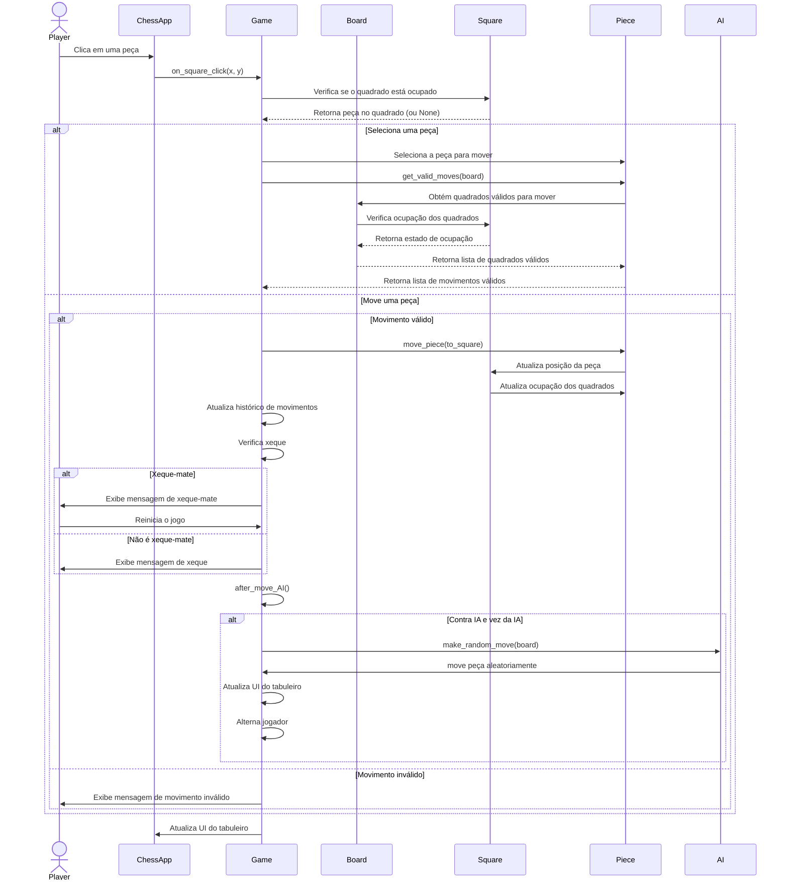

# Diagrama de Classe

```mermaid
classDiagram

class Player{
	String color
	List pieces
	+get_valid_moves(board: Board): List
}

class Game{
	root: Tk
	against_ai: bool
	Board board
	List players
	int current_player_index
	List move_history
	selected_piece

    +start_game()
    +setup_board_ui()
    +on_square_click(x: int, y: int)
    +move_piece(piece: Piece, to_square: Square)
    +update_board_ui()
    +current_player(): Player
    +is_in_check(color: str): bool
    +is_checkmate(color: str): bool
    +show_checkmate_message(color: str)
    +restart_game()
    +promote_pawn(pawn: Pawn)
    +after_move_AI()
}

class Board{
	List<List<Square>> squares
	+initialize_board()
}

class Square{
	int x
	int y
	Piece piece
	+is_occupied(): bool
	+get_piece(): Piece
}

class Piece{
	String color
	Square position
	String symbol
	+get_valid_moves(board: Board): List
}

class Bishop{
	String symbol
	+get_valid_moves(board: Board): List
}

class King{
	String symbol
	+get_valid_moves(board: Board): List
}

class Queen{
	String symbol
	+get_valid_moves(board: Board): List
}

class Pawn{
	String symbol
	int direction
	bool has_moved
	+get_valid_moves(board: Board): List
}

class Rook{
	String symbol
	+get_valid_moves(board: Board): List
}

class Knight{
	String symbol
	+get_valid_moves(board: Board): List
}

class AI{
    +make_random_move(board: Board)
}

Game --> Board
Game --> Player
Board --> Square
Square --> Piece

Piece <|-- Bishop
Piece <|-- King
Piece <|-- Queen
Piece <|-- Pawn
Piece <|-- Rook
Piece <|-- Knight
Player <|-- AI

```

# Diagrama de Sequência

```mermaid
sequenceDiagram
    actor Player
    participant ChessApp
    participant Game
    participant Board
    participant Square
    participant Piece
    participant AI

    Player->>ChessApp: Clica em uma peça
    ChessApp->>Game: on_square_click(x, y)
    Game->>Square: Verifica se o quadrado está ocupado
    Square-->>Game: Retorna peça no quadrado (ou None)
    alt Seleciona uma peça
        Game->>Piece: Seleciona a peça para mover
        Game->>Piece: get_valid_moves(board)
        Piece->>Board: Obtém quadrados válidos para mover
        Board->>Square: Verifica ocupação dos quadrados
        Square-->>Board: Retorna estado de ocupação
        Board-->>Piece: Retorna lista de quadrados válidos
        Piece-->>Game: Retorna lista de movimentos válidos
    else Move uma peça
        alt Movimento válido
            Game->>Piece: move_piece(to_square)
            Piece->>Square: Atualiza posição da peça
            Square->>Piece: Atualiza ocupação dos quadrados
            Game->>Game: Atualiza histórico de movimentos
            Game->>Game: Verifica xeque
            alt Xeque-mate
                Game->>Player: Exibe mensagem de xeque-mate
                Player->>Game: Reinicia o jogo
            else Não é xeque-mate
                Game->>Player: Exibe mensagem de xeque
            end
            Game->>Game: after_move_AI()
            alt Contra IA e vez da IA
                Game->>AI: make_random_move(board)
                AI->>Game: move peça aleatoriamente
                Game->>Game: Atualiza UI do tabuleiro
                Game->>Game: Alterna jogador
            end
        else Movimento inválido
            Game->>Player: Exibe mensagem de movimento inválido
        end
    end
    Game->>ChessApp: Atualiza UI do tabuleiro

```
