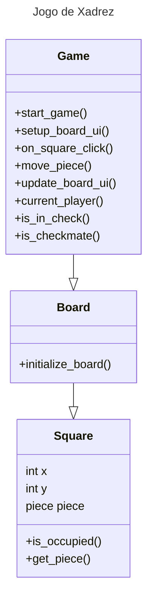

```mermaid
---
title: Jogo de Xadrez
---
classDiagram


class Game{
    +start_game()
    +setup_board_ui()
    +on_square_click()
    +move_piece()
    +update_board_ui()
    +current_player()
    +is_in_check()
    +is_checkmate()
}

class Board{
	+initialize_board()
}

class Square{
	int x
	int y
	piece piece
	+is_occupied()
	+get_piece()
}

Game --|> Board
Board --|> Square
```
