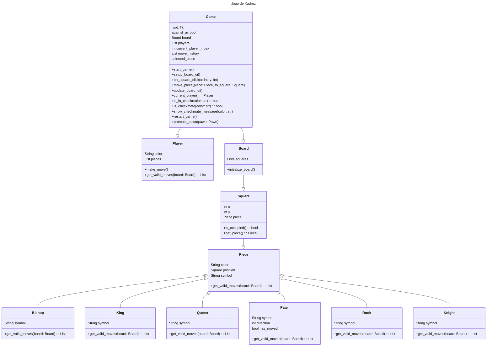

```mermaid
---
title: Jogo de Xadrez
---
classDiagram

class Player{
	String color
	List pieces
	+make_move()
	+get_valid_moves(board: Board): List
}

class Game{
	root: Tk
	against_ai: bool
	Board board
	List players
	int current_player_index
	List move_history
	selected_piece

    +start_game()
    +setup_board_ui()
    +on_square_click(x: int, y: int)
    +move_piece(piece: Piece, to_square: Square)
    +update_board_ui()
    +current_player(): Player
    +is_in_check(color: str): bool
    +is_checkmate(color: str): bool
    +show_checkmate_message(color: str)
    +restart_game()
    +promote_pawn(pawn: Pawn)
}

class Board{
	List<List<Square>> squares
	+initialize_board()
}

class Square{
	int x
	int y
	Piece piece
	+is_occupied(): bool
	+get_piece(): Piece
}

class Piece{
	String color
	Square position
	String symbol
	+get_valid_moves(board: Board): List
}

class Bishop{
	String symbol
	+get_valid_moves(board: Board): List
}

class King{
	String symbol
	+get_valid_moves(board: Board): List
}

class Queen{
	String symbol
	+get_valid_moves(board: Board): List
}

class Pawn{
	String symbol
	int direction
	bool has_moved
	+get_valid_moves(board: Board): List
}

class Rook{
	String symbol
	+get_valid_moves(board: Board): List
}

class Knight{
	String symbol
	+get_valid_moves(board: Board): List
}

Game --|> Board
Game --|> Player
Board --|> Square
Square --|> Piece

Piece <|-- Bishop
Piece <|-- King
Piece <|-- Queen
Piece <|-- Pawn
Piece <|-- Rook
Piece <|-- Knight

```
